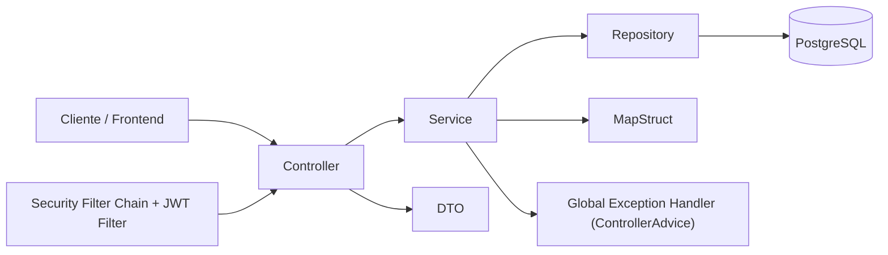

# Gestión de proyectos e Incidencias
APIRest construida con Spring Boot y PostgreSQL, con autenticación basada en JWT, refresh tokens y roles de usuario, incluyendo filtros, paginación y pruebas unitarias

### Tecnologías utilizadas
* Backend: Spring Boot, Spring Security, Spring Data JPA
* Base de datos: PostgreSQL
* Autenticación: JWT + Refresh tokens, BCrypt
* Testing: JUnit, Mockito
* Contenedores: Docker + Docker Compose
* Documentación: Swagger / OpenAPI
* Mapeo: MapStruct
* Boilerplate reduction: Lombok

### Seguridad implementada
* Encriptación de contraseñas con BCrypt
* Autenticación stateless con JWT
* Implementación de Refresh Token persistido en base de datos
* Filtro JWT personalizado
* Control de acceso basado en roles
* Configuración de SecurityFilterChain

# Funcionalidades principales
### Autenticación
* Registro de usuario
* Login y Logout
* Generación de Access Token
* Renovación mediante Refresh Token
* Protección de endpoints
### Gestión de proyectos
* CRUD completo
* Validaciones con @Valid

### Gestión de incidencias
* CRUD completo
* Asignación de incidencia a usuario
* Filtros por:
  * Estado
  * Usuario
  * Rango de fechas
* Paginación con Pageable
  
### Control de transiciones de Estado en incidencias
Las incidencias implementan una máquina de estados simple para definir transiciones válidas entre estados, permitiendo:
* Evitar cambios inconsistentes
* Centralizar reglas de negocio
* Mejorar la mantenibilidad
* Facilitar la testabilidad

### Testing
* Test unitarios del servicio Issue
* Test de creación valida
* Test de filtros
* Test básico de seguridad

## Diseño de API
### Uso de DTO
Se implementan DTOs para separar el modelo de persistencia del modelo expuesto en la API permitiendo:
* Evitar exponer entidades directamente
* Controlar los datos enviados/recibidos
* Mejorar la seguridad
El mapeo se realiza mediante MapStruct

### Manejo Global de Excepciones
La API implementa un sistema centarlizado de manejo de errores mediante @ControllerAdvice, garantizando respuestas consistentes, cuyos objetivos son:
* Evitar lógica repetida entre los controladores
* Diferenciar errores técnicos de errores de negocio.
* Devolver respuestas HTTP coherentes
* Facilitar el debugging mediante loggin estructurado

Se ha implementado una jerarquía para clasificar los errores:
* BaseException -> Errores de negocio (400 Bad Request)
* NotFoundBaseException -> Recursos no encontrados (404 Not Found)
* AuthenticationException -> Errores de autenticación (401 Unauthorized)
* AccessDeniedException -> Acceso denegado (403 Forbidden)
* MethodArgumentNotValidException -> Errores de validación (400 Bad Request)
* Exception -> Errores inesperados (500 Internal Server Error)
Todas las excepciones devuelven un objeto estructurado:
>{  
  "status":  
  "error":   
  "message":   
  "path":   
}

### Logging
Los errores no controlados son registrados mediante SLF4J, incluyendo
* URI de la petición
* Mensaje de error
* Stack trace

## Instalación
1. Clonar el repositorio
> git clone https://github.com/alroar/IssueTrackerAPI/  
cd issue-tracker-api

2. Configurar variables de entorno
   cp .env.example .env

    Credenciales para el desarrollo / producción  
    DB_URL=  
    DB_USERNAME=  
    DB_PASSWORD=  
    DB_PORT=  
    
    Datos para configurar JWT  
    JWT_SECRET=  
    JWT_EXPTIME=  
    
    Puerto del servidor  
    SERVER_PORT=  
    
    Credenciales para el contenedor de la base de datos  
    POSTGRES_DB=  
    POSTGRES_USER=  
    POSTGRES_PASSWORD=

3. Modificar src/main/resources/application-prod.yml  
En el apartado ddl-auto: none, cambiar el none por auto

4. Instalar dependencias  
./mvnw clean install  

5. Ejecutar la aplicación  
  En local  
    ./mvnw spring-boot:run  
  Con Docker
    docker-compose up --build
6. Verificar la conexión
   La API estará disponible en
   > http://localhost:8080

###
Documentación API: http://localhost:8080/docs

### Arquitectura

### Flujo de autenticación

1. El usuario realiza login.
2. Se genera un JWT Access Token.
3. El Refresh Token se persiste en base de datos.
4. El filtro JWT valida cada petición protegida.
5. El control de roles se aplica mediante Spring Security.
